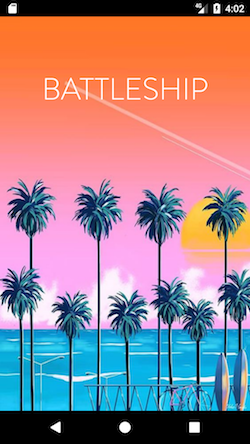
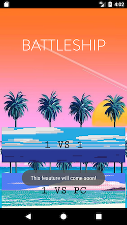
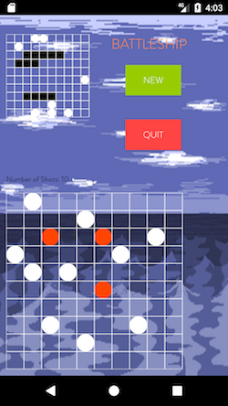

Battleship
======
### About the program
Update 1.1 
 *This version allows the user to place boats on the grid while playing a game with the computer.*

*View Java Classes* [Click Here](https://github.com/oiricaud/Battleship/tree/master/app/src/main/java/edu/utep/cs/cs4330/battleship).

*View Assignment* #2  [Click Here](https://github.com/oiricaud/Battleship/blob/master/HW2-Assignment.md).

*View Assignment* #1  [Click Here](https://github.com/oiricaud/Battleship/blob/master/HW1-Assignment.md).

Class Diagram
=

 

  

Assignment #3 
======

	 CS 4330/5390: Mobile Application Development, Spring 2017
			HOMEWORK 3: Networking
		 (File $Date: 2017/03/30 22:06:33 $)

Due: April 13, 2017

This homework may be done individually or in pair. 

In this homework you will extend your HW2 code to allow a user to play
network (P2P) Battleship games. The player and the opponent plays a
game on two different Android devices. Your app shall support at least
one of three different connection types: Bluetooth, Wifi-Direct, and
Wifi. Your app shall meet the following functional and non-functional
requirements.

R1. It shall provide a way to start a P2P game.

R2. It shall provide a way to connect to a peer, i.e., the opponent's
    device.

R3. As in previous homework, it shall allow a user to start a new
    game. If a game is already in progress, it shall alert the user to
    get a confirmation.

R4a. If Wifi/WifiDirect is off, it shall inform the user and direct to
     the built-in Wifi/WifiDirect setting app. Hint: Use an implicit
     intent (e.g., android.provider.Settings.ACTION_WIFI_SETTINGS) to
     launch a built-in wifi setting app.

R4b. If Bluetooth is off or not paired, it shall inform the user and
     direct the user to the built-in Bluetooth setting app. Hint: Use
     an implicit intent (e.g., BluetoothAdapter.ACTION_REQUEST_ENABLE
     and android.provider.Settings.ACTION_BLUETOOTH_SETTINGS) to
     launch a built-in bluetooth setting app.

R4. It shall consist of at least two activities, one for deploying the
    user's ships (R2) and the other for making shots (R3).

R5. Separate network operations into a separate module to decouple
    them from the rest of your code.

R6. Use the following configuration for your project.

1. (15 points) Design your app and express your design in a UML class
   diagram [2]. Your class diagram should include both model classes
   and UI classes (see R5 above) by using a layered architecture,
   where the business logic layer is completely separated from the
   presentation layer.

   - Your class diagram should show the main components (classes) 
     of your app, their roles and their relationships. 
   - Your model (business logic) classes should be cleanly separated 
     from the view/control (UI) classes with no dependency.
   - For each class in your diagram, define key (public) operations
     to show its roles or responsibilities.
   - For each association including aggregate and composite, include
     at least a label, multiplicities and directions.
   - For each class appearing in your class diagram, provide a brief 
     description.

2. (85 points) Code your design. Your code should conform to your
   design.

3. (10 bonus points) Support WifiDirect or Bluetooth.

HINTS

  Reuse your HW2 design and code as much as possible. Refine your
  class hierarchy by introducing HW3 specific concepts and (sub)
  classes, such as network games and network players. Most of HW2 view
  and model classes should be reusable. It is strongly recommended to
  define a communication protocol (e.g., types of messages being sent
  between peers and their orderings) and to define a separate class
  for it, say NetworkAdapter (see R5 above). The following classes may
  be useful for your implementation.
  
  
  Wifi
    android.net.ConnectivityManager
    android.net.wifi.WifiManager

  Wifi Direct
    android.net.NetworkInfo
    android.net.wifi.p2p.WifiP2pInfo
    android.net.wifi.p2p.WifiP2pManager

  Bluetooth
    android.bluetooth.BluetoothAdapter
    android.bluetooth.BluetoothDevice
    android.bluetooth.BluetoothServerSocket
    android.bluetooth.BluetoothSocket
    java.util.UUID
    

TESTING

  Your code should compile using SDK version 25 and run correctly on
  Android 4.0 (API Level 14) and later.
  
 WHAT AND HOW TO TURN IN

  You should submit your program through the Assignment Submission
  page found in the Homework page of the course website. You should
  submit a single zip file that contains:

HINTS
   
   Reuse your HW1 design and code as much as possible. Organize your
   classes in a class hierarchy. You will have several classes with
   similar structures and behaviors, e.g., different board views.

TESTING

   Your code should compile using SDK version 25 and run correctly on
   Android 4.0 (API Level 14) and later.

WHAT AND HOW TO TURN IN

   You should submit your program through the Assignment Submission
   page found in the Homework page of the course website. You should
   submit a single zip file that contains:

   - A UML class diagram and associated documents (if any)
   - An Android package (APK) file. Read Section 1.9 (Sharing Your 
     Android Applications) for creating an Android distribution file.
     On Android Studio, use Build > Generate Singed APK ... menu.
   - Source code---the Java src directory in your project folder 
     (app/src/main/java). Include only Java source code files; do 
     not include other files like resource/build files.

   Your zip file should contain a single root directory named
   YourFirstNameLastName in which all the above-mentioned files and
   directories reside, e.g.,

   - readme.txt (if you have anything to say to TA)
   - design.doc (UML class diagram along with descriptions)
   - battleship.apk (signed APK file)
   - src/... (Java source code files and directories)

   If you work in pair, make only one submission by mentioning both
   names. You should turn in your program by midnight on the due date.

DEMO

   You will do an demo of your app, either in-class or to TA. Bring a
   WiFi-capable Android device with your app installed; you may also
   use an AVD on your laptop. Prepare a 2~3 minutes demo of your app.

GRADING

   You will be graded on the quality of your design and how clear your
   code is. Excessively long code will be penalized: don't repeat code
   in multiple places. Your code should be well documented by using
   Javadoc comments and sensibly indented so it is easy to read.

   Be sure your name is in the comments in your source code.

REFERENCES 

   [1] Martina Seidl, et al., UML@Classroom: An Introduction to
      Object-Oriented Modeling, Springer, 2015. Free ebook through
      UTEP library.
